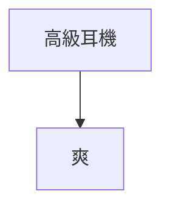
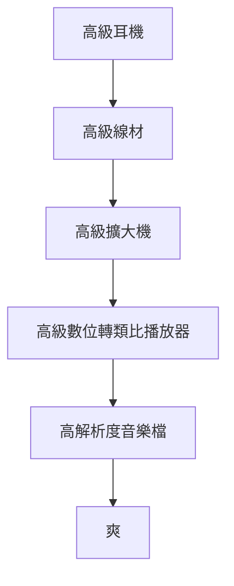
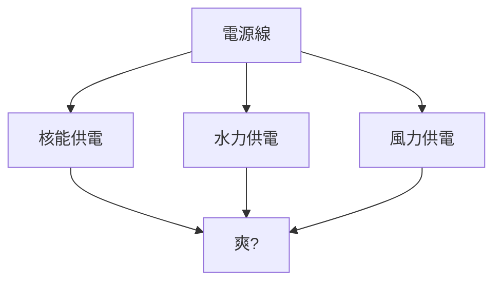
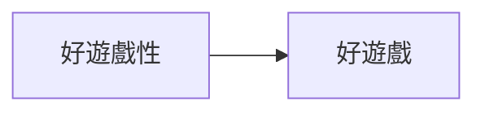
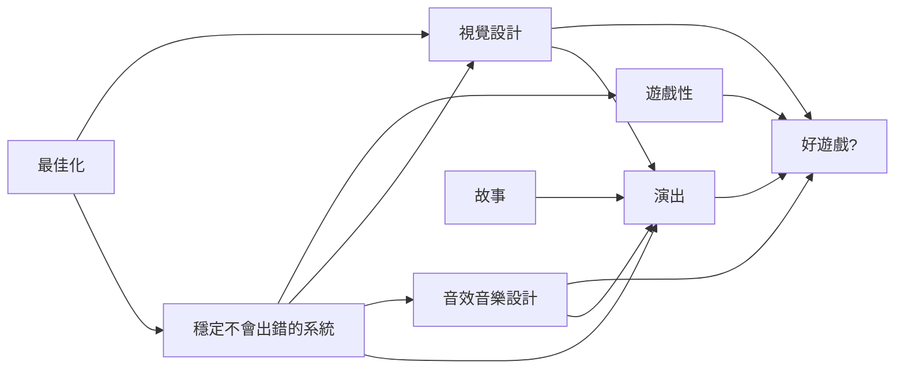
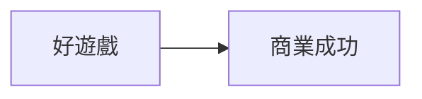
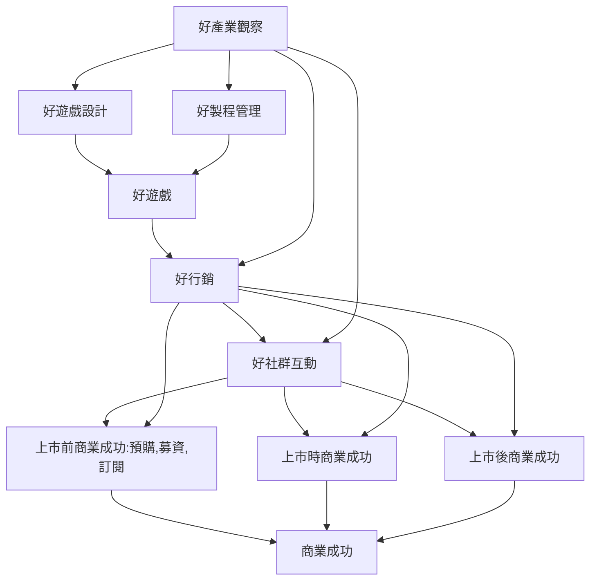
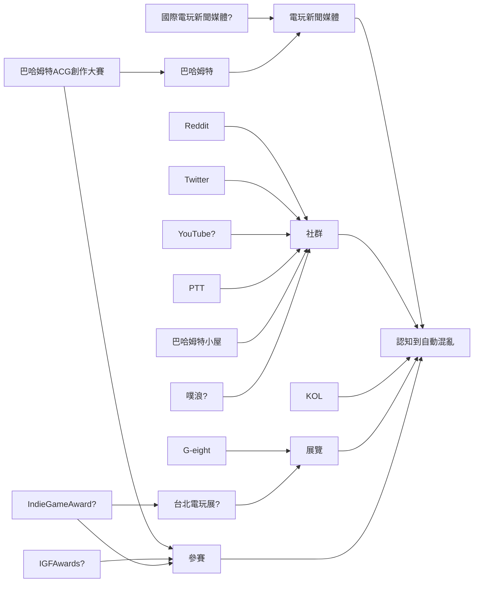
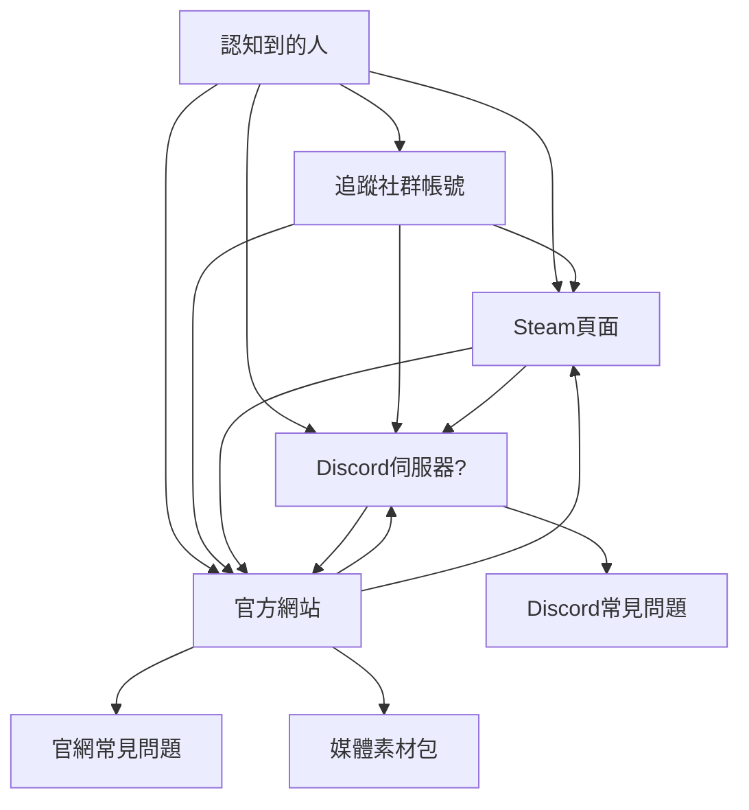
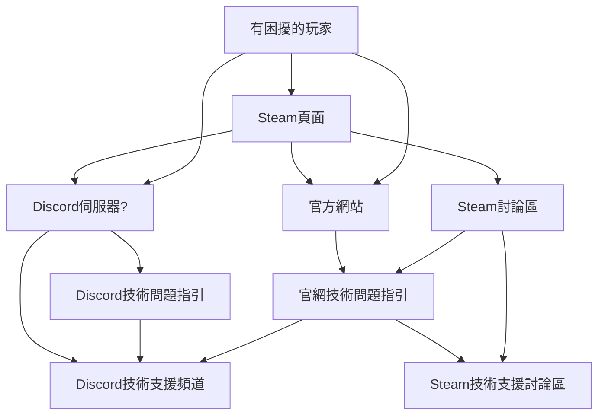

好久不見，今天我們要來聊聊高級耳機的話題。

# 高級耳機的迷思

搞不好只有我這樣覺得啦，但總之幾年前，真正入耳機坑前，我對高級耳機的理解就是：

買了高級耳機，就應該要可以聽得很爽，對吧？

畢竟都要花幾萬塊在一個東西上了，自然而然會希望投資報酬率好一點，希望就買這次就可以搞定所有未來需求。

實際上的確也是聽得滿爽的，就算只是接上 iPhone 也是可以聽得很開心，但很快地就會意識到這幾萬塊的耳機雖然提升了聆聽體驗的下限，卻有大幅增高的上限沒能被發揮。

要真正發揮一支高級耳機的話，完整的流程如下：

其中中間每一環的有無、品質，全都會影響到最終的聆聽體驗。要獲得最高品質的體驗時，看似要投入的只有高級耳機的錢財，最後實際上得在所有中途品質的確保上也都花上不少把銀子，罪過罪過，阿彌陀佛。

當然還會有人跟你跟你說電源線跟發電廠電力來源會影響聆聽品質，**但那些都是邪教**。

> 不是，供電系統的每一環都是設計來阻止這種問題的，如果真的會影響的話有夠可怕的喔？？？？

總之耳機的話題就到這邊，接著我們來聊聊行銷。

# 商業成功的連鎖

延續前述的概念，對於做出一款好遊戲的迷思可能是：

然而實際上可能是：

> 這不是絕對的承襲關係，根據遊戲類型與製作方式不同可能會產生不同的樣貌

如蜘蛛網般的承襲關係，彼此之間的乘法效應非常明確。

而延續到商業成功的遊戲時，也差不多。可能會以為是：

但實際上是：

光是要做出一款好遊戲就需要良好的製程管理，但即便如此也只是提升做出好遊戲的機率。做出好遊戲也只是提升商業成功的上下限，並沒有辦法保證立即、也沒有辦法保證坐落在這個商業成功上下限光譜的哪一側。

也因此如果追求的是立即的商業成功，中間任何一環的缺失都是在跟自己過意不去。但如果做遊戲只是為了自己爽，服務到別人是順便的話就沒差啦 XD

總之在這個基礎上，雖然《自動混亂》與衍生作《零式》都不是真正為了立即商業成功而開發的作品，但可以順便獲得的話也不錯，在這方面投入了一些對應的準備與努力，這邊詳細地說明一下。

# 《自動混亂》的行銷與社群準備

由於是個<abbr title="其實做了快滿三年好像也不該稱為新手了，但大概做完前都只敢這樣自稱">初出茅廬的新手</abbr>，必須要全方面地投入讓人能夠看見自己的努力，例如說，這篇文章本身確實就是這樣的努力 XD

如果試著視覺化《自動混亂》相關的行銷結構的話，大概就是這樣：

> 標註「?」的是考慮中但還沒實行的

認知到《自動混亂》之後，也還需要做剩下的引導，協助各種不同身分的人可以找到自己需要的資訊。

## 簡化使用者取得資訊的流程

使用者取得資訊的路線可能長這樣：

還要注意結構會不會太多層，讓玩家太遠才能夠取得所想要的資訊的話，玩家就可能就會放棄取得資訊，錯失潛在玩家。行銷上會用<abbr title="funnel">漏斗</abbr>來形容，最外層的玩家數一定會最多，往下每走一步就會像漏斗一樣慢慢變少。

同理，對於媒體與 <abbr title="Key Opinion Leader; 關鍵意見領袖">KOL</abbr> 來說，因為開發者的立場希望能盡量獲得曝光，所以要避免媒體得經過太多層才能取得想要的資訊，否則錯失被進一步曝光的機會。也因此會特別製作名為<abbr title="Presskit">媒體素材包</abbr>的資料整理，讓想要撰寫相關報導、製作相關影片的人能夠很快地找到所有需要的資訊。

例如說，這是[《自動混亂》目前的媒體素材包](/tw/presskit/autopanic)，目前還有些缺少的素材（預告片、方便打包下載的版本、多種解析度），但應該算勉強堪用了。

## 逆其道而行的增加流程

雖然可能很違反直覺，但某些情況下應該要增加層數，協助使用者找不到你（？）

例如說如果設置一個公司電話專線，提供玩家立刻就可以找到遊戲製作人抱怨跟解決，可能玩家會覺得非常方便。然而只能說無奈時間人力有限，如果把投入工作的人力都拿應對客服的話就本末倒置了。尤其對像我這樣的單人開發者來說，會希望可以降低把自己有限的時間得拿來解決玩家問題的可能性。

但倒不是說惡意逼退玩家 XD 例如說對於遭遇到技術問題的玩家，可以嘗試設置「技術問題指引」來協助處理大半的問題，實質上也是減少玩家必須要等待開發者回覆、解決問題的情境。這是[《自動混亂》的技術問題指引](/tw/tech-fixes/autopanic)，裡面覆蓋了我目前為止想到所有玩家可能會遭遇到的基礎問題。某種意義上來說，超過這個範圍的問題，就算是我也不確定我能不能解決（汗

玩家求助的流程可能如下：

然後希望玩家在中間走到技術問題指引時就可以先被過濾掉，降低最後必須消耗人力、工時應對才處理的最後階段，著重在處理一些最嚴重必須被最優先對待的案例。

總之大概是這樣，接下來到上市前，除了開發完遊戲以外，得逐步踏實準備好這些東西！