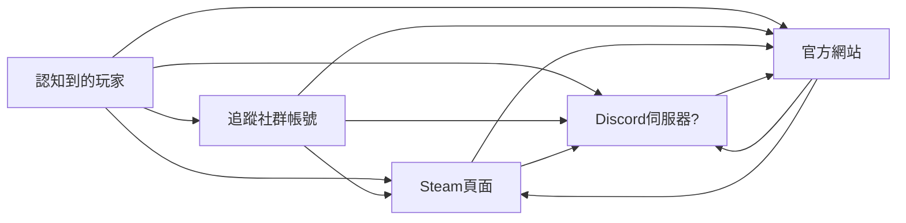
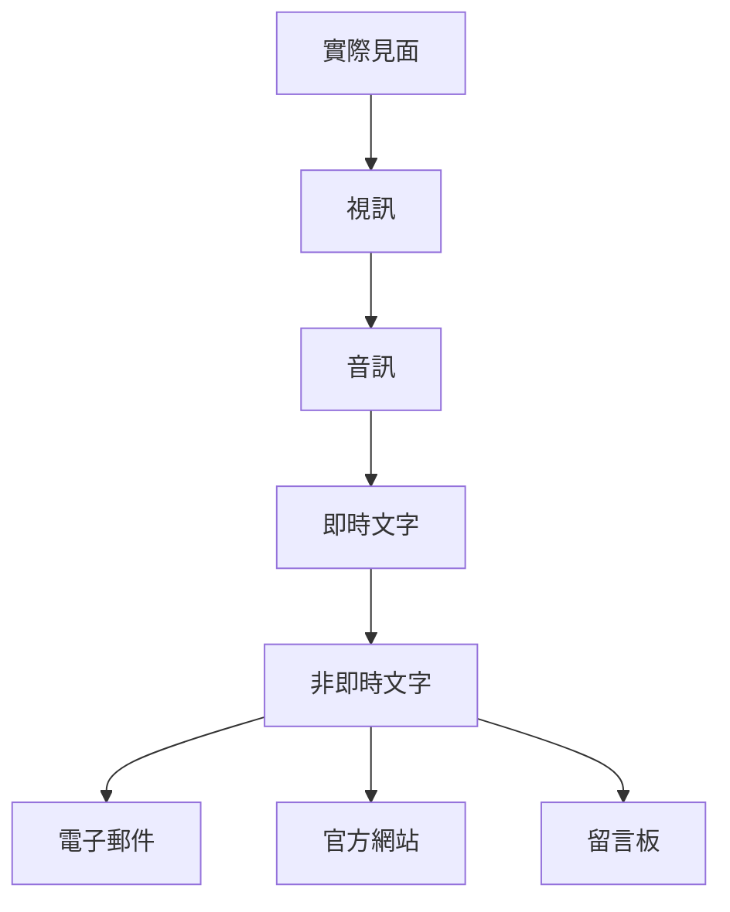

其實一直都有知道官網的重要性，之前也半調子地準備過一次。

不過總之這波是因為[海龜](https://twitter.com/aaefiikmnnnr)在 [IGDS Discord 伺服器](https://discord.gg/eUfnCqVkRz)上簡單的一句，促使我就這樣一整套做到底了 XD

> 感謝海龜！

總之先隨手寫一下我對「官方網站」的必須性的一些想法。

# 官方網站的必須性

總之在[上一篇文章](/tw/posts/game-design/0012-show-off-your-efforts)提過一次玩家取得資訊的流程：

以玩家側使用的合理性與方便性來說，基本上 Steam 頁面與 Discord 伺服器應該是目前的主要目標位置，但是如果簡單觀察這張圖的話，可以看到兩件事情：

- 官方網站是整個資訊鍊的最後一環
- 唯一真正可以自己控制的資訊表現手段

雖然不是要說 Steam 跟 Discord 在可見的未來內會死亡，但是這些平台允許、希望表現資訊的手段不一定隨時都符合自己的需求，而玩家也不一定能可靠地透過這些管道去取得自己所想要的資訊。

無論什麼時候，官方網站的存在對玩家來說就是終極的堡壘，只有到哪裡就應該要能絕對性地找到所有需要的資訊。反過來說開發者也因此應該有義務確保玩家的終極手段永遠都可用，那邊的情報才是必須要永遠確保最新的位置。

Discord 伺服器的出現似乎讓很多工作室／個人開發者都省事省錢選擇只架設伺服器，但如果今天一名玩家偏偏就是不想要使用 Discord，或者處於無法使用 Discord 的狀態時，就會帶來極大的困擾。

**那個玩家就是我**，我超不想要加入額外的 Discord 伺服器 XD

# 溝通的成本

溝通的成本是雙向的，要雙方都有意願付出對應溝通成本時，溝通才能完成。各種類型溝通成本由高到低大概可以表列成這樣：

與此相對的，也是資訊傳達方便性的高到低。

有人可以為了方便性而付出對應地成本，但有人不願意，而當互動被強迫要以超出一方願意付出的成本進行時，溝通就會被直接放棄。

總之都是可以被平衡的設計，如果沒有辦法照顧到各種需求的人的話，就可能會直接導致溝通的斷絕。

這裡可以再舉幾個例子。

## 帳號的建立

現在具備持續更新性質的服務／遊戲都會想要盡量<abbr title="騙取">取得</abbr>使用者／玩家的資訊，必須要建立帳號來管理資訊，為了方便。然而提供資訊的隱憂和輸入資訊的麻煩性都是溝通成本的存在。

因此其中一種方法是提供 Google 帳號、Facebook 帳號、Apple ID 等迅速創建帳號的手段，降低輸入資訊的麻煩性。

而反過來有許多手機遊戲會選擇延後登入帳號的時機，先讓玩家在甚至是首抽後才要求登入，就能夠先向玩家證明遊戲的好玩性，彌補玩家疑慮的成本。

## 問卷的選項

問卷的溝通成本或許更好理解，例如說：

- 長的問卷成本越高、短的問卷成本越低
- 問卷中如果把每一格都設計成「詳答」，理論上可以獲得最詳盡的結果，但是填答者的填寫成本就會越高；為了輔助填答者，通常會設計選項幫助考慮

反過來說如果問卷中的選項沒有辦法覆蓋到填答者需求，就會反而大幅增加溝通成本，而可能會被棄填。

舉例來說如果問題是「遊戲好不好玩」，而選項只有：

- 超好玩
- 好玩
- 還行

的話，覺得根本就不好玩的填答者沒辦法發表意見，必須得找到某種形式的詳答備註欄才能完整傳達意見，這時候比起試著付出這個溝通成本來傳達這個意見，填答者可能就會直接放棄整份問卷。

當然呃，拜託不要設計這種自欺欺人的選項，然後理想狀況下可能有例外的問題，就要允許詳答例外／其他。

# 架設網站的理由

總之這個網站算是複合性地做兩種用途：個人部落格、遊戲官網。

個人部落格算是考慮很久必須做的事情，現在台灣的遊戲相關主流社群是：

- 巴哈姆特
- Facebook
- PTT
- 噗浪？
- Discord？
- Line？

整體來說其中相對適合寫長文的地方只有：

- 巴哈姆特－台灣的最主流遊戲社群
- PTT－最核心的社群所在、平台具備絕對的網路中立性
- Facebook－就那個大家都嫌但大家還是在上面

而很不幸地，這三個都有對應的問題：

- 巴哈姆特－排版工具充足但是產生出來的文字結構很髒
- PTT－缺乏充足的排版工具、社群最小
- Facebook－缺乏充足的排版工具、可搜尋性很爛

也因此我之前所有系統性的文章全都發在巴哈姆特和 PTT，Facebook 上永遠都只會轉址。而當然在沒有一個絕對功能性最好的環境下，最後還是只能靠自己架設一個網站來解決問題了。

一開始原本想偷懶架 Wordpress，但各種介面與網站管理的負擔反而造成更多困擾，於是轉向尋找 Markdown 引擎編譯的靜態網站形式。

## Markdown

Markdown 的純文字排版雖然缺乏一些很極端的工具組，但是除了可以滿足大多數的排版需求外，還可以確保原始資料的純粹性，要複製貼上到其他地方再根據需求修改都很簡單。

而因為是自己做的網站，也可以很輕易地引入一些額外 Markdown 工具，像是可以自動產生流程圖的工具：

而當然也就能順便將這些產生出來的流程圖截圖下去用到其他網站上 XD

## Hugo + Github Page

原本是要用 [Hexo](https://hexo.io/zh-tw/)，但後來在 Github Action 部署上遭遇問題，就先擱置了一段時間。

後來海龜提起了 [Hugo](https://gohugo.io/)，就順手試試看，沒想到跟著官方教學路程上都很順就一路弄到現在了這樣全套了 XD 連要怎樣使用 Github Page 架設的 Action 都寫好給你，複製貼上照著步驟走就完全沒問題。

佈景主題是使用 [nodejh/hugo-theme-mini](https://github.com/nodejh/hugo-theme-mini) 但老實說有滿多實作不算做得很好，像是：

- 雖然說支援多國語言設定
    - 但沒有內建切換功能
    - 有一堆網址使用的是單一語言的相對、絕對網址，導致實際使用多國語言時會出錯
- 缺乏一些基本的排版邏輯，例如說圖片置中

後來做了這些調整：
- 修好佈景主題多國語言的路徑問題
- 圖片自動置中
- 新增變數，可以在頁面指定允許圖片的放大
- 根據海龜建議接了 [utterance.es](https://utteranc.es/) 當留言板，雖然有留言者必須要有 Github 帳號的限制但......會看這個網站又想留言的人應該還好吧？
- 新增變數，可以視狀況顯示目錄
- 新增變數，可以視狀況顯示文章資訊（日期、字數），不然用在非部落格文章的頁面很怪 XD
- 加入 [mermaid](https://gohugo.io/content-management/diagrams/)的支援顯示流程圖
- 加入有點廢但算堪用的語言切換功能

# 未來

應該會慢慢棄掉其他難以維護的平台吧，頂多只會轉文（望

就看時間許可來決定吧。