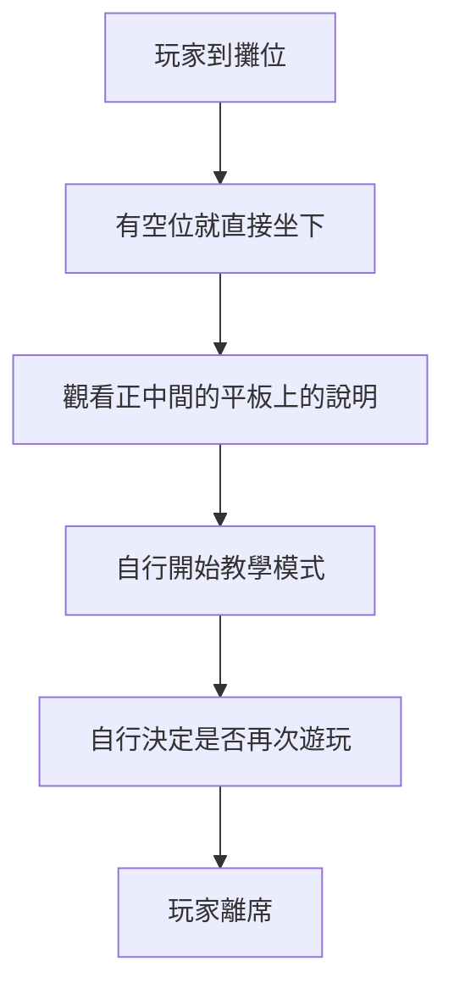

去年十二月舉辦的 [G-Eight 遊戲展](https://geight.io/)，主打是：

> ☆ ㊣ ↙ ::: 一個由玩家自己籌辦，屬於玩家的電玩展 ::: ↗ ㊣ ☆

去年有這機會參加 G-Eight 遊戲展，不過無奈《自動混亂》當時意識到並不是個適合展場展出的遊戲（[參考原因]()）。簡單思考後，想起有自己隨手做了七天的《自動混亂：零式》應該是個合理能在展場遊玩的作品，因此就攜帶著這款去參展了。

參展前後有許多個人心得。本來想說自己<abbr title="根本沒參加過">也不是什麼參展常客</abbr>，沒有什麼對標活動能提供參考，應該將這種事情留給經驗更豐富的攤位去發文參考。不過時隔了半年，除了零星的小心得與[粽子](https://home.gamer.com.tw/homeindex.php?owner=enchnater000)的展覽心得「[帶著 RM 去展覽 - GeneWars G-EIGHT 展覽心得](https://forum.gamer.com.tw/C.php?bsn=4918&snA=30552)」以外，基本上就沒有任何可以參考的內容。

總之身為能有機會寫文章摸魚就寫文章摸魚的人，就交給我來詳述 G-Eight 的參展好處、建議準備，以及跟主辦方互動時可能要注意的事項。

除了這篇文章以外，也推薦參考更多人的心得做交叉比對，例如在這裡推薦一下[小峰](https://twitter.com/PeDev)的參展心得「[G8、台北、夏日電玩展參展比較](https://qwe321qwe321qwe321.github.io/posts/51246/)」

# 參展好處

G-Eight 遊戲展，客觀來看大概是國內對開發者來說最有幫助的展覽機會。在這邊說明一下具體的好在哪。

## 空間規劃

G-Eight 的參展費用是一萬元，跟台北電玩展的 Indie House 最低單位一致。但是攤位規格相當大而舒適（3 公尺寬）相較於台北電玩展明顯小很多還要兩組共用的攤位（1.5 公尺寬），只能說是好太多了。攤位間距充滿餘裕，非常舒適。

| G-Eight                                           | 台北電玩展                                                |
| ------------------------------------------------- | --------------------------------------------------------- |
|  |  |

攤位背板是主辦方不須外加費用的統一輸出，並且由主辦方負起背板的布置與撤除責任，對於小團隊來說非常有幫助，真的要我單人佈設跟撤出還真不知道該怎麼做。

除此之外，兩側的四組廠商加起來有一個相當寬敞的儲物空間兼休息室可以使用：

## 人流規模

舒適的間距其實相對於人流也只是恰好而已。根據[官方資訊顯示](https://gnn.gamer.com.tw/detail.php?sn=242647)，三天的遊戲展的總計人流量是 1.5 萬人次。展出當下本來以為週五的表現已經很不錯了，然而週六日的現場可以說是又到了人滿為患的程度了 XD

當然人次也終究是人次，實務上試玩人流不可能到這麼多。《自動混亂：零式》因為遊戲設計的關係，有著「一場最多十分鐘以內」的性質，在這個超快週轉速度之下，實際上三天大概就是 300 人試玩。以 3 天、8 小時、10 分鐘一場、2 個座位來說，理論上限就是：

$$3 \times 8 \times 60 \times 2 \div 10 = 288 人$$

可以說是非常極限的結果了，其中靠了許多展出的規劃才能達成，後續會再詳細提到。

## 其他展覽特色

主辦方在這次展覽中除了另外有準備舞台可以提供廠商申請使用以外，也另外有許多別出心裁的小設計，讓人十分讚許。例如將展覽設定為下午一點開始，雖然現場就會變成拖到晚上九點才收攤，但考慮人類假日習性來說，這應該是比較好的選擇。

在這邊另外提出兩個有趣的設計。

### 人氣投票

現場提供有讓玩家進行人氣投票的機會。雖然最佳人氣獎這種殊榮當然保證由特定頂尖的團隊（上次來說就是《九日》跟《炎姬》）包辦，但對於廠商來說也是個很踏實的開發期中考。

雖然沒辦法奪下獎項，但是當有玩家決定相對於大作而應該投票給自己的作品時，就已經是作品基本品質（或者是個人陰德值）的檢驗了。將這個檢驗結果幻化為物理上存在的物品讓自己參考，是非常有價值的。

### 集換式卡片

本次活動中，主辦方還精心規劃集換式卡片活動，印製卡片一樣統一由主辦方進行，不需要出展廠商額外的支出，只要提供素材就好。

由於所有攤位都有固定的 100 張卡片，因此對於有收集卡片的想法的玩家，自然而然有動力去與比較容易不被注意到的廠商互動。事後來看 100 張的規劃也可能過於保守，尤其是《自動混亂：零式》的攤位由於人流量超高，第二天開場沒多久就已經將 100 張卡片發完了。

# 參展準備

對活動本身做了許多簡介，在這邊想要詳述一下對於《自動混亂：零式》的攤位，我是如何做整體展示的規劃來協助活動的順利進行。

## 試玩版設計

《自動混亂：零式》正式版本故意做了無接縫教學的設計，也就是一開啟遊戲直接進教學，教學玩馬上進第一次遊玩。實際遊玩時有許有點炫，但是這個設計在試玩的時候並沒有辦法產生幫助。

這個設計下，導致每個玩家遊玩後，遊戲都必須要人工完整關閉遊戲後才能重新開啟教學，自然不是很理想。因此後續改成了主選單內直接有進行教學以及正常遊玩的選項：

如此一來就不需要耗費人力去持續干涉攤位的進行。

## 攤位結構

《自動混亂：零式》的攤位大致狀況如下：

背板因為沒空所以做得很隨便 XD 但總之配置是這樣：

- 兩台筆電
- 兩個 DualSense 手把，放置於桌面中間的 PlayStation 官方雙手把充電座
- 因為設備數量限制只有一台有額外提供滑鼠使用
- 正中間配置說明用平板
- 另外攜帶延長線從桌子中間供電給所有設備
- 椅背貼著引流指示

選用 DualSense 只是因為我剛好有雙手把充電座，配置方便而已 XD 沒特別理由。後續認為背板當時設計上，可以直接納入 QR Code 讓人連到商店頁面，或者是觀看操作說明、影片。

## 攤位流程自動化

第一天過後我就意識到雖然直接與玩家溝通不差，但一天下來要講很多話還是<abbr title="老了">生理上應付不太來</abbr>，於是加上了椅背的引流指示：

> 座位如果是空的，就可以自由坐下試玩

並且於座位中間直接設立說明平板（使用平板是為了看狀況調整內容）：

後續把整個攤位流程順化成這樣：

至此達成了完全的攤位自動化。達成這個自動化也有一個重要目的：把注意力空出來觀察玩家體驗。

相較於玩家的回饋，同時觀察玩家的手把操作方式、臉部表情以及畫面內容實務上比請玩家填寫問卷還要更直接有幫助。問卷比較適合大規模回收資訊，但是要求玩家延時回想遊戲體驗本身就比較困難，而遊玩者也很容易將自己的需求誤會成要用完全無關的方式來解決問題。因此在有大量人流試玩的 G-Eight 遊戲展可以說是絕佳的遊戲體驗測試場，透過三天的迭代就能讓遊戲品質產生巨大的提升。

另外也推薦參考[小峰](https://twitter.com/PeDev_)當時的[雙螢幕試玩方式](https://qwe321qwe321qwe321.github.io/posts/19189/)，做法是輸出第二螢幕遊戲畫面給玩家，而第一螢幕保留所有除錯資訊給開發者在不需要干擾玩家的情況下觀察遊玩狀況。

總之也因為做了自動化，才能達成三天三百人的週轉。另外提一下，一人顧攤還是太極限了，有兩人輪班體驗會好非常多。（← 顯示為第三天腿部失去知覺）

# 參展注意事項

畢竟第一屆策展，有缺失也是情有可原。不過參展的時候，最好還是要預先考量潛在的行政負擔，來應對參加的狀況。

## 溝通不良

本屆執行中，陸續有一些因溝通不良而產生的困擾。在這邊就直接詳細舉例說明性質。

### 提供讓人困惑的資訊

**卡面**

在要求提供集換式卡面的卡面素材時，官方提供的指引是一份簡報：

然而上面的尺寸標示不足以理解要迴避的範圍的具體位置，所幸官方還提供了一份 PSD 檔......呃？

這份 PSD 就是這頁簡報的本身......依然不足以定位具體要迴避的範圍。導致最後卡面素材提交時，依然只能靠著純粹的猜測來調整卡面配置。

**攤位規格**

官方第一次提供的場地範例如下：

跟上面的尺寸標示，以及最後實際的規格都不一致。所幸是更為寬裕，並沒有造成額外的問題。

### 提供資訊不足

**投票活動進行方式**

投票的進行方式上，廠商唯一收到的簡報內容如下：

簡單來說完全沒通知到廠商具體形式是使用代幣投入小豬撲滿的方式進行。

**對於集換式卡片的使用方式期許**

關於廠商對集換式卡片獲得的相關簡報，內容如下：

簡單來說沒有任何官方發送方式指引。

《自動混亂：零式》的發送方式是「試玩後就發送」，而由於超高週轉率，最後大概在第二天下午四點就發送完畢。後續有工作人員來問剩餘卡片數量時，我回答說已經全數發放完畢時，被工作人員問說我為什麼已經發完時才發現這並不符合主辦方對於卡片發放的期待。

事後從[官方的檢討文](https://www.facebook.com/geight.fb/posts/201937069065338/)看來，主辦方的期望應該是要求廠商將 100 張卡片分散於三天發送，每天有發送上限。但是這部分從來都沒有與廠商溝通過 XD

**After Party 通知失誤**

這相當輕微，不過我完全沒有接收到 After Party 存在的通知 XD

於活動結束後好一陣子，我才聽說相關通知只有在廠商布置日的某些時段派人告知。但我因為我佈展當天要先忙完 SIGONO 的工作才能前往現場，是晚上七點時到場（表定佈場結束是八點），所以完全沒有得到相關消息。

## 其他雜項

除卻比較讓人困擾的溝通不良系列問題外，有一些更為零碎的不良互動也在這邊點出提供參考。

**被假設有充裕的軟體應對**

繳交背板的時候，所要求的格式是 AI 檔。雖然使用 Adobe 全家桶應該算是某種業界慣例，不過依然不是泛用格式。

**舞台音量很大**

舞台的音量，真的，很、大、聲。距離舞台不算近的我一直有被重低音轟炸的感受。

**撤展餘裕不足**

表定的晚上九點結束，是玩家與廠商都必須於九點撤離。而不是玩家撤離後，留給廠商額外時間整理撤離。

**展後茶會邀請時限過窄**

展後經過一陣子，對廠商提出了開茶會檢討的邀請。邀請於 1/14（六）寄出，然後要求在 1/18 前就要回覆。活動時間訂定在平日的下午兩點到四點。

**Discord 伺服器管理疑慮**

事後開設了 Discord 伺服器邀請玩家與廠商共同參加，這個 Discord 伺服器會使用 YouTube 機器人進行 @everyone 的無條件通知，通知 YouTube 頻道有新影片。無條件使用機器人做全域通知，通知對象還包含有參展廠商下，恐怕不是最理想的伺服器管理方針：這樣的設計下 Discord 伺服器似乎比起讓廠商、玩家有機會交流以外，更像是供 YouTube 頻道方便進行曝光的場域。如果因此而讓伺服器成員都轉而將通知無條件關閉的話，似乎就本末倒置了。

# 結語與期許

G-Eight 遊戲展是目前綜觀國內展出場合中，對獨立遊戲來說 CP 值最高的展覽。人流、場地規畫都是一等一，能夠善用此機會的話就可以獲得大幅度曝光與遊戲設計驗證。第一屆的舉辦下，主辦執行上不免有許多毛病，還待觀察後續幾屆能否改善這些問題。但即便如此，在審慎考慮團隊的行程下，根據人力去決定是否能投資應對一些潛在的成本，也就不至於到無法應付。

期許未來能夠繼續茁壯，改善缺點，最後或許能穩定成為比起台北電玩展更能幫助獨立遊戲團隊成長的場域。
